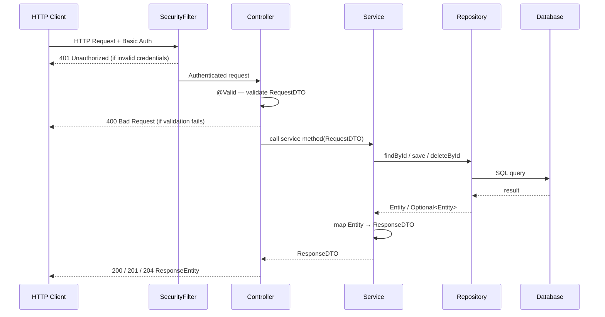
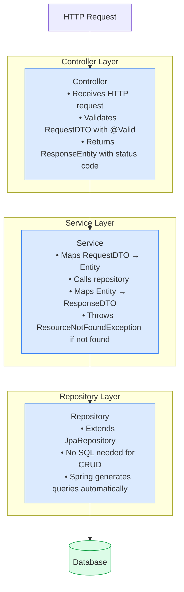
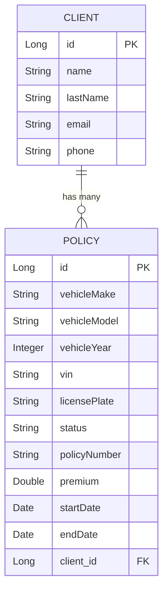
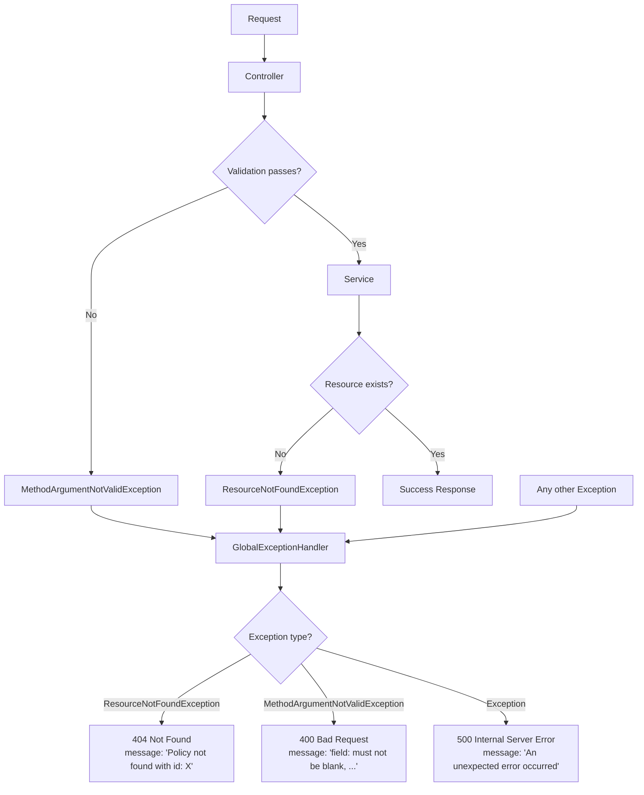
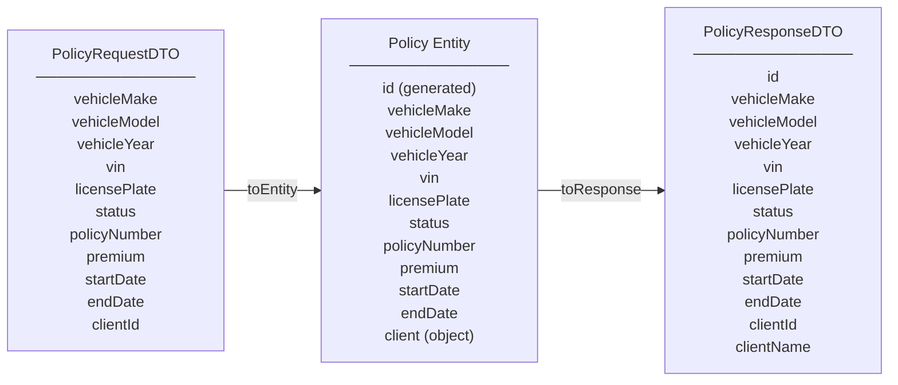

# Auto Policy Management API — Workflow Diagrams

---

## 1. Full Request Lifecycle

Every HTTP request passes through these layers in order:

---

## 2. Layer Responsibilities

---

## 3. Data Model

---

## 4. Exception Handling Flow

---

## 5. DTO Flow

